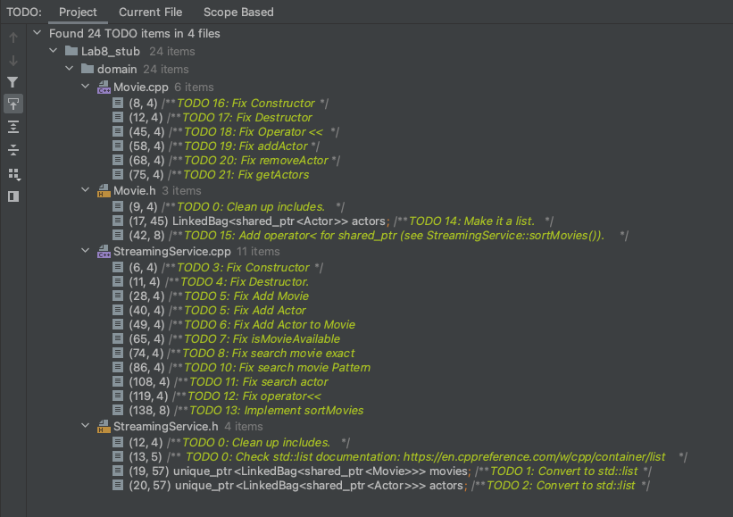

# Laboratory #8 - C++ Standard Template Library -- C++ STL

-----
**CSCI2421 - Summer 2021**

### **_Team Members Names:_**
- Student #1: `Darius Deese`
- Student #2: `Ray Khan`

### **Lab Status**
```text
Describe **briefly** how complete your lab is, and how did you tested it.
Our lab seems to be working properly. We tested each method.

Lab also seems to be compiling on CSEGrid.
```

-----

## TODO:
1. Complete your and your teammates' names on the top of this document.
1. Open the **TODO tab** on CLION, and complete the implementation. (Image below shows a snapshot of that).
   - COMPLETE THE TODOS IN SEQUENCE STARTING FROM `StreamingService` CLASS.
1. **Document your code**, as described on Canvas.
1. All team members should be working concurrently using **code-with-me on Clion**.
1. If you have questions, use Zoom _"Ask for help button"_ on the toolbar (bottom), and the instructors will get to
   your room asap. You can also use Slack concurrently.
1. **Please keep your camera turned on, so you can interact with your team.**
1. Instructors will be walking through the rooms regularly.
1. Push your solution to GitHub
1. Complete the *Lab Status* section on this document.
1. Complete Discussion.




## Submission
- Complete the lab.
- On CLion execute Build --> Clean from the menu (this will remove all temporary files)
- Using zip, compress the entire CLion Project and upload it to canvas before 11:35am.
- **LATE SUBMISSIONS**: NO LATE SUBMISSION 
- Zoom session will close after our class time    


- **AT 11:40AM, WE WILL DISCUSS THE FINAL EXAM**


## Domain Description
We will continue working on the Streaming Service topic we developed in _Lab #1_ and _Lab #2_.
Nonetheless, most domain is already implemented for you. 

YOU WILL CONVERT THE CODE TO USE STL. The implementation may be slightly different from yours but not too much. 
